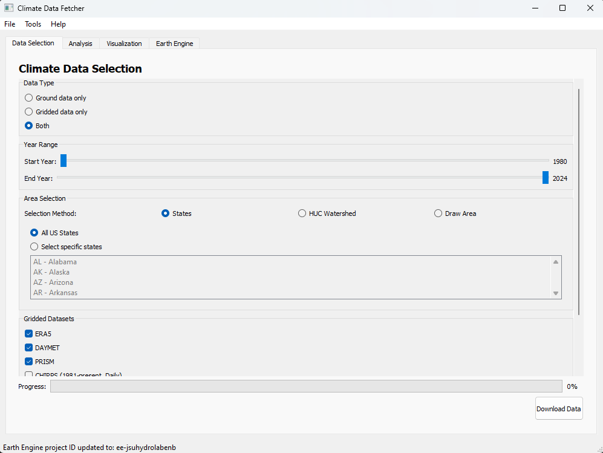

# Climate Data Fetcher GUI

A comprehensive PyQt5 application for retrieving, analyzing, and visualizing precipitation data from multiple sources. This tool enables researchers to systematically compare ground station measurements with gridded precipitation products such as ERA5, DAYMET, PRISM, CHIRPS, FLDAS, GSMAP, and GLDAS.



## 🔧 Installation

### Option 1: Using Conda (Recommended)

```bash
# Clone the repository
git clone https://github.com/Saurav-JSU/GeeData-GroundData-validator.git
cd GeeData-GroundData-validator

# Create and activate conda environment
conda create -n climate-data-fetcher python=3.8
conda activate climate-data-fetcher

# Install dependencies
pip install -r requirements.txt

# Set up Earth Engine authentication
earthengine authenticate
```

### Option 2: Using Pip and venv

```bash
# Clone the repository
git clone https://github.com/Saurav-JSU/GeeData-GroundData-validator.git
cd GeeData-GroundData-validator

# Create and activate virtual environment
python -m venv venv

# On Windows:
venv\Scripts\activate
# On macOS/Linux:
source venv/bin/activate

# Install dependencies
pip install -r requirements.txt

# Set up Earth Engine authentication
earthengine authenticate
```

### System Dependencies for Non-Conda Users

If you're not using Conda, you might need additional system libraries for the geospatial dependencies:

**Windows:**
- Download and install [GDAL](https://www.gisinternals.com/release.php) binaries
- Add GDAL to your system PATH

**Ubuntu/Debian:**
```bash
sudo apt-get install python3-dev libgdal-dev libproj-dev libgeos-dev
```

**macOS:**
```bash
brew install gdal geos proj
```

### Google Earth Engine Authentication

This application uses Google Earth Engine for accessing gridded datasets. To use these features:

1. Sign up for Google Earth Engine at https://earthengine.google.com/signup/
2. Once approved, run `earthengine authenticate` to set up your credentials
3. Note your Earth Engine project ID for use in the application

## 🚀 Quick Start

### Method 1: Using run_pipeline.bat (Windows)

1. Double-click `run_pipeline.bat` in the project folder
2. Follow the prompts to set up the environment and launch the application
3. The GUI will open automatically once setup is complete

### Method 2: Running directly

```bash
# Activate your environment first, then:
python main.py
```

### Expected Output

Upon successful launch, you'll see the Climate Data Fetcher GUI with three main tabs:

1. **Data Selection Tab**: Here you can:
   - Select your area of interest (states, HUC watersheds, or custom polygon)
   - Set the time period for analysis
   - Choose which gridded datasets to download
   - Start the data fetching process

2. **Analysis Tab**: After downloading data, you can:
   - Run statistical analysis to compare gridded products with ground observations
   - View summary statistics and detailed metrics tables
   - Analyze performance at daily, monthly, and seasonal scales

3. **Visualization Tab**: With analysis complete, you can:
   - Generate various visualization types (maps, time series, box plots, etc.)
   - Browse the visualization gallery
   - Export images for use in reports or presentations

## 📁 Project Structure

```
GeeData-GroundData-validator/
├── main.py                   # Application entry point
├── config.py                 # Configuration classes
├── controller/               # MVC controllers
│   ├── app_controller.py     # Main application controller
│   ├── data_fetching_controller.py
│   ├── analysis_controller.py
│   └── visualization_controller.py
├── src/                      # Core functionality
│   ├── data/                 # Data fetching modules
│   │   ├── ground_fetcher.py # Ground station data retrieval
│   │   └── gridded_fetcher.py # Gridded data retrieval
│   ├── analysis/             # Analysis modules
│   │   └── statistical_analyzer.py # Statistical analysis
│   └── visualization/        # Visualization modules
│       └── plot_results.py   # Plotting functions
├── ui/                       # PyQt5 UI components
│   ├── app_window.py         # Main application window
│   └── panels/               # UI panels for different functions
├── utils/                    # Utility functions
│   ├── statistical_utils.py  # Statistical calculation utilities
│   ├── plotting_utils.py     # Plotting utilities
│   ├── earth_engine_utils.py # Earth Engine integration
│   └── huc_utils.py          # HUC watershed utilities
├── Data/                     # Downloaded data (created on first run)
├── Results/                  # Analysis results (created during analysis)
└── Plots/                    # Generated visualizations
```

## 📝 Notes

### System Requirements

- **Python Version**: 3.7 - 3.9 recommended (3.8 optimal)
- **Operating System**: Windows 10/11, macOS, or Linux
- **RAM**: Minimum 4GB, 8GB+ recommended for larger datasets
- **Disk Space**: At least 2GB free space for data, results, and visualizations

### Known Issues

- Earth Engine authentication may time out after extended periods. Re-run `earthengine authenticate` if you encounter API errors.
- High-resolution visualizations may require significant memory, especially for large study areas.
- The application is currently optimized for the Continental United States; other regions may have limited data availability.
- FLDAS dataset is monthly only and cannot provide daily statistics.

### Common Setup Problems

1. **PyQt5 Installation Issues**: 
   - On some Linux distributions, you might need additional packages: `sudo apt-get install python3-pyqt5`
   - On macOS, you might need to install Qt first: `brew install qt`

2. **Earth Engine Authentication Failed**:
   - Ensure you have an approved Earth Engine account
   - Try running `earthengine authenticate --quiet` in a separate terminal
   - Verify your internet connection and firewall settings

3. **GeoPandas/GDAL Issues**:
   - These packages can be tricky to install with pip. If you encounter problems, consider using conda instead
   - Make sure system libraries are installed (see installation section)
   - Use `conda install -c conda-forge geopandas` for the most reliable installation

4. **Application Crashes When Drawing Areas**:
   - Ensure you've provided a valid Earth Engine project ID in the settings
   - Try restarting the application after authentication
   - Use predefined regions instead of custom drawing if problems persist

## 📚 Documentation

For detailed documentation, refer to the ERDC Technical Note accompanying this software package.