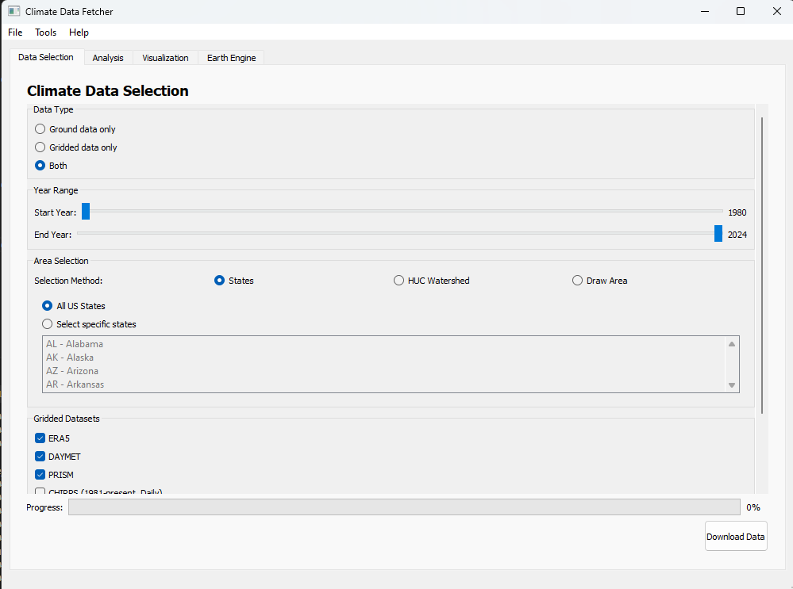
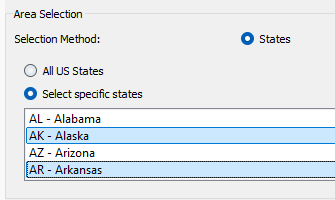
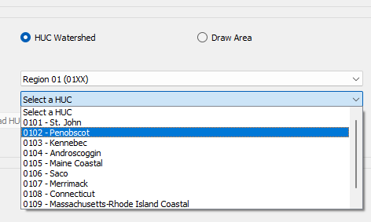
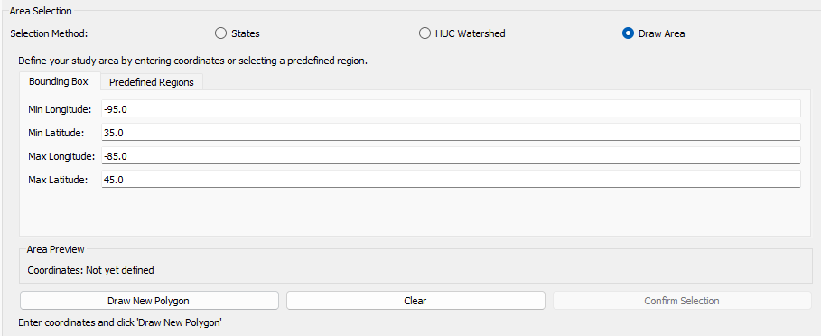
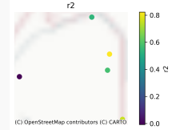
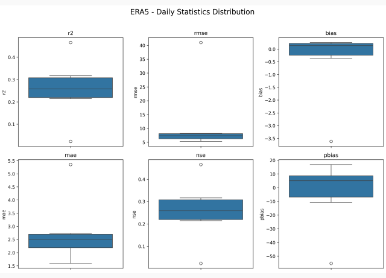
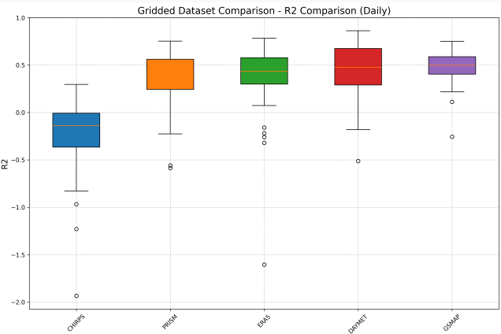

# Climate Data Fetcher GUI

A comprehensive PyQt5-based desktop application for fetching, analyzing, and visualizing climate data. The tool allows researchers to compare ground station precipitation measurements with various gridded datasets from Google Earth Engine, offering powerful statistical analysis and visualization capabilities.



## Table of Contents
- [Overview](#overview)
- [Key Features](#key-features)
- [Architecture](#architecture)
- [Installation](#installation)
- [Usage Guide](#usage-guide)
- [Data Selection](#data-selection)
- [Analysis Capabilities](#analysis-capabilities)
- [Visualization Features](#visualization-features)
- [Configuration](#configuration)
- [Dependencies](#dependencies)
- [Development Status](#development-status)
- [Contributing](#contributing)
- [License](#license)
- [Contact](#contact)

## Overview

Climate Data Fetcher GUI bridges the gap between ground-based weather station data and gridded climate datasets. It provides researchers, hydrologists, and climatologists with a user-friendly interface to:

- Download precipitation data from ground stations via Meteostat
- Access multiple gridded precipitation datasets from Google Earth Engine
- Compare data using statistical methods across various temporal scales
- Generate publication-ready visualizations
- Validate gridded products against ground truth data

The tool streamlines the entire workflow from data acquisition to visualization, enabling efficient climate data analysis.

## Key Features

### Data Sources

#### Ground Data
- **Source**: Meteostat weather station network
- **Variables**: Daily precipitation measurements
- **Coverage**: Continental US (with expansion to global coverage in development)
- **Period**: 1980-2024 (varies by station)
- **Selection**: By geographic region (states, watersheds, or custom boundaries)

#### Gridded Datasets
| Dataset | Resolution | Temporal Scale | Coverage | Period | Variable |
|---------|------------|----------------|----------|--------|----------|
| ERA5 | 0.25° | Daily | Global | 1979-present | total_precipitation_sum |
| DAYMET | 1km | Daily | North America | 1980-present | prcp |
| PRISM | 4km | Daily | Continental US | 1981-present | ppt |
| CHIRPS | 5.5km | Daily | Global (50°S-50°N) | 1981-present | precipitation |
| FLDAS | 11km | Monthly | Global | 1982-present | Rainf_f_tavg |
| GSMAP | 11km | Hourly→Daily | Global (60°S-60°N) | 2000-present | hourlyPrecipRateGC |
| GLDAS-Historical | 28km | 3-hourly→Daily | Global | 1948-2014 | Rainf_f_tavg |
| GLDAS-Current | 28km | 3-hourly→Daily | Global | 2000-present | Rainf_f_tavg |

All gridded datasets are accessed via Google Earth Engine API and converted to consistent units (mm/day).

### Data Selection Methods

#### State-based Selection
- Select all US states or specific states
- Multi-select capability for regional studies
- Familiar interface for US-focused research



#### HUC Watershed Selection
- Select by Hydrologic Unit Code (HUC) watersheds
- Organized by region for easy navigation
- Essential for hydrological and water resource studies
- Provides watershed metadata (area, states covered)



#### Custom Boundary Drawing
- Define study area using precise coordinates
- Bounding box definition
- Predefined regions (Northeast, Midwest, etc.)
- Most flexible option for specific study areas



#### User-provided Station Data (Under Development)
- Support for custom station data and metadata
- Recognition of latitude/longitude coordinates
- Enables use beyond Continental US
- Backend functionality implemented, UI integration in progress

### Analysis Capabilities

#### Statistical Metrics
- **R²**: Correlation coefficient (goodness of fit)
- **RMSE**: Root Mean Square Error (absolute error magnitude)
- **Bias**: Systematic error (over/under-estimation)
- **MAE**: Mean Absolute Error (average absolute difference)
- **NSE**: Nash-Sutcliffe Efficiency (model performance)
- **PBIAS**: Percent Bias (percent deviation)

#### Temporal Analysis Options
- **Daily**: Direct comparison of daily values
- **Monthly**: Aggregated monthly totals with threshold for valid data
- **Yearly**: Aggregated yearly totals with threshold for valid data
- **Seasonal**: Breakdown by meteorological seasons:
  - Winter (Dec-Feb)
  - Spring (Mar-May)
  - Summer (Jun-Aug)
  - Fall (Sep-Nov)
- **Extreme Value Analysis**: Performance for high/low precipitation values

### Visualization Features

#### Spatial Distribution Maps
- Shows spatial patterns of performance metrics
- Color-coded for easy interpretation
- Includes contextual base maps
- Station-level performance analysis



#### Statistical Visualizations
- **Box Plots**: Distribution of metrics across stations
- **Time Series**: Direct comparison of ground vs. gridded data
- **Radar Charts**: Multi-metric and seasonal performance visualization



#### Dataset Comparison
- Side-by-side comparison of multiple datasets
- Consistent metrics across datasets
- Identification of best-performing datasets



## Architecture

The application follows an MVC-like architecture with clear separation between UI, controllers, and data processing:

- **UI Layer**: PyQt5-based user interface with modular panels
- **Controller Layer**: Manages application flow and connects UI with business logic
- **Business Logic Layer**: Core functionality for data fetching, analysis, and visualization
- **Data Layer**: Handles data storage, loading, and configuration management

Multi-threading is implemented for long-running operations to ensure a responsive UI.

## Installation

### Prerequisites
- Python 3.7 or higher
- Google Earth Engine account (for gridded datasets)
- Git (for cloning the repository)

### Steps

1. Clone the repository:
```bash
git clone https://github.com/username/climate-data-fetcher.git
cd climate-data-fetcher

2. Create and activate a virtual environment:

   ```bash
   # Windows
   python -m venv venv
   venv\Scripts\activate

   # macOS/Linux
   python -m venv venv
   source venv/bin/activate
   ```

3. Install dependencies:

   ```bash
   pip install -r requirements.txt
   ```

4. Authenticate with Google Earth Engine:

   ```bash
   earthengine authenticate
   ```

### Usage

#### Basic Workflow

1. Run the application:

   ```bash
   python main.py
   ```

2. Select your region of interest:
   - US States
   - HUC Watersheds
   - Custom boundaries

3. Choose datasets from available options.

4. Specify date range (1980-2024).

5. Download and analyze data.

6. Generate visualizations.

## Configuration

### Earth Engine Setup
- Requires an authenticated Google Earth Engine account.
- Optional project ID can be specified in the Earth Engine tab.

### Application Settings
- Config file location: `~/.climate-data-fetcher/config.json`
- Project files use `.cdp` extension.

## Dependencies

### Core Packages
- `PyQt5` (>=5.15)
- `pandas` (>=1.3)
- `numpy` (>=1.21)
- `geopandas` (>=0.10)
- `matplotlib` (>=3.5)
- `seaborn` (>=0.11)

### External Services
- Google Earth Engine API
- Meteostat API

## Development

### Current Features
- State and HUC-based region selection.
- Multi-dataset comparison.
- Data caching system.
- Interactive visualizations.

### Planned Features
- User-provided station data support.
- Global coverage expansion.
- Additional climate variables.
- Machine learning integration.

## Contributing

### Guidelines
1. Fork the repository.
2. Create a feature branch:
   ```bash
   git checkout -b feature/new-feature
   ```
3. Commit your changes with descriptive messages.
4. Push to your branch:
   ```bash
   git push origin feature/new-feature
   ```
5. Open a pull request.

### Code Standards
- Follow PEP 8 style guide.
- Include docstrings for all functions.
- Write unit tests for new features.
- Update documentation accordingly.

## License
MIT License - See LICENSE for details.

## Contact
- **Saurav Bhattarai** - ORISE Fellow
- GitHub: [your-github-username]
- Email: [your-email@example.com]